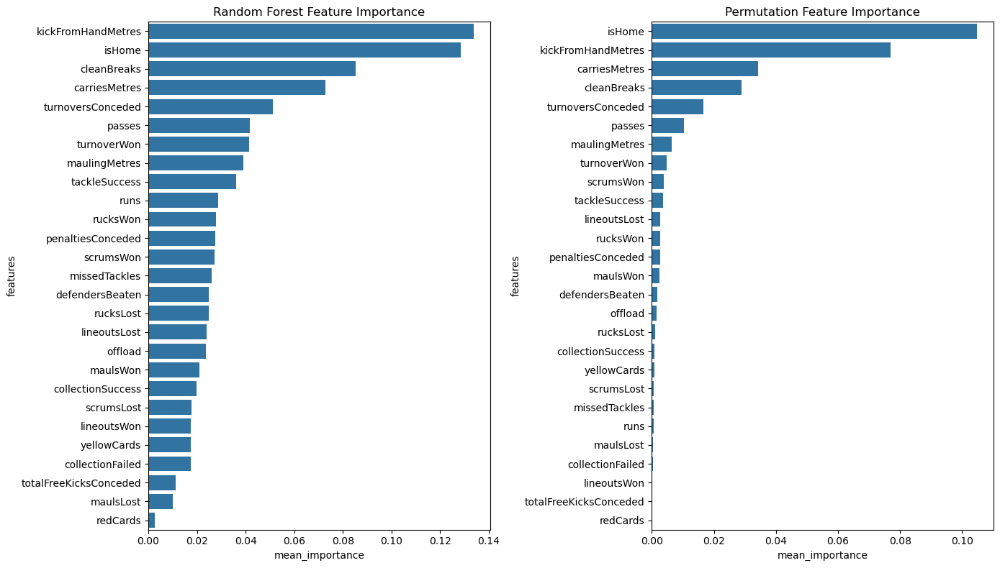

# Impact of Key Performance Indicators and Home Advantage on Match Outcomes in Top 14 Rugby: A Data-Driven Analysis Using Machine Learning
## About The Project
This project analyzes key performance indicators (KPIs) in the French Top 14 rugby competition. It aims to identify the most significant predictors of match outcomes, evaluate the effectiveness of a reduced set of KPIs, and examine the impact of home advantage on both model performance and individual KPIs.
The analysis is based on data from 1,085 unique matches played between 2017 and 2023, using relative performance metrics and machine learning techniques.



## Getting Started

### Setup

1. **Clone the repository**
   
    ```
    git clone https://github.com/your-username/top14-rugby-analysis.git
    cd top14-rugby-analysis
    ```
2. **Set up the Python environment**
    ```
    python -m venv top14_analysis_venv
    ```
    Activate the virtual environment:
    - On Windows:
    ```
    rugby_scraper_venv\Scripts\activate
    ```
    - On macOS and Linux:
    ```
    rugby_scraper_venv/bin/activate
    ```

3. **Install the required packages**:
   ```
   pip install -r requirements.txt
   ```

   This will install all the necessary dependencies for the project.
   > **📢Note :** <br>
   >  If you're not using a virtual environment, the packages will be installed globally on your system. Be aware that this might affect other Python projects you have.
  Or, if you prefer not to use a virtual environment, you can skip this step.

### Usage

The main analysis is contained in the Jupyter notebook [notebook/rugby_kpi.ipynb](notebook/rugby_kpi.ipynb). 

**To run it:**
```
  jupyter notebook rugby_kpi.ipynb
```

## Data Source
The data used in this project was collected by scraping the ESPN website. The original database contains significantly more data than what is used in this specific analysis. The data collection process was carried out using a separate project, which is publicly available in the following repository:

https://github.com/hans-brgs/rugby-data-scraper/

This rugby data scraper project allows for the systematic collection of rugby match data, providing a comprehensive dataset for analysis. Key features of the collected data include:
- Leagues data by season
- Teams data
- Stadiums data
- Player data
- Standings data by season
- Match datas and statistics by league and season
- player datas and statistics for each match

While the current project uses a subset of this data focused on team-level performance in the Top 14 competition, the full dataset offers potential for much broader and more in-depth analyses. This includes the possibility of studying individual player contributions, tracking player performance over time, and conducting cross-league comparisons.
We encourage users interested in accessing or contributing to the data collection process to visit the [rugby-data-scraper](https://github.com/hans-brgs/rugby-data-scraper/) repository for more information. The wealth of player-specific data opens up numerous avenues for advanced rugby performance analysis.

## Technical Approach
The project uses the following approach:
  1. Data preprocessing and feature engineering on relative performance metrics
  2. Feature selection using multiple methods:
    - Recursive Feature Elimination with Cross-Validation (RFECV)
    - Random Forest Classifier Feature Importance
    - Permutation Importance
  3. Random Forest classification on full and reduced datasets
  4. Model comparison using McNemar's test
  5. Analysis of home advantage impact using paired t-tests and effect sizes

## Contributing
This project is part of ongoing research in rugby performance analysis. We welcome contributions that can improve the quality and depth of this work. Peer review and collaborative efforts are essential for advancing our understanding of rugby performance indicators.
If you're interested in contributing, please consider the following:
  1. Replication studies to validate my findings
  2. Extension of the analysis to other rugby competitions or seasons
  3. Improvements to the statistical methods or machine learning models used
  4. Additional data sources that could enhance the analysis
  5. Critical review of the methodologies and conclusions

Please feel free to submit a Pull Request or open an Issue for discussion. All contributions will be acknowledged.

## Acknowledgments
I would like to express my gratitude to the authors of the following key papers, which significantly influenced this research:
1. Bennett M, Bezodis N, Shearer DA, Locke D, Kilduff LP. Descriptive conversion of performance indicators in rugby union. J Sci Med Sport. 2019 Mar;22(3):330-334. doi: 10.1016/j.jsams.2018.08.008.
2. Scott GA, Edwards O, Bezodis NE, Waldron M, Roberts E, Pyne DB, Mara J, Cook C, Mason L, Brown MR, Kilduff LP. Classifying Winning Performances in International Women's Rugby Union. Int J Sports Physiol Perform. 2023 Aug 18;18(9):1072-1078. doi: 10.1123/ijspp.2023-0086.
3. Scott GA, Bezodis N, Waldron M, Bennett M, Church S, Kilduff LP, Brown MR. Performance indicators associated with match outcome within the United Rugby Championship. J Sci Med Sport. 2023 Jan;26(1):63-68. doi: 10.1016/j.jsams.2022.11.006.

These studies have provided invaluable information and methodological approaches that have served as the basis for this project.